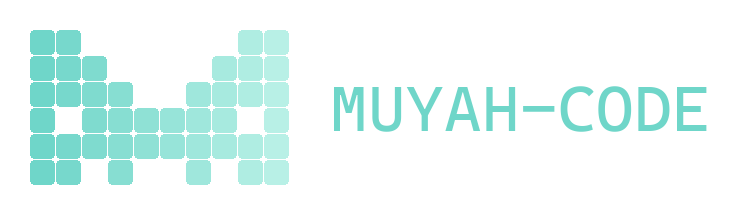
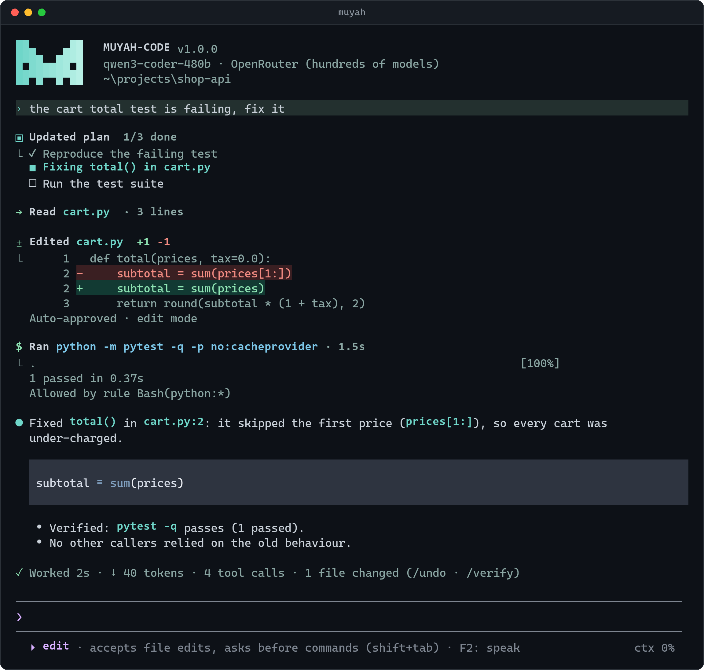
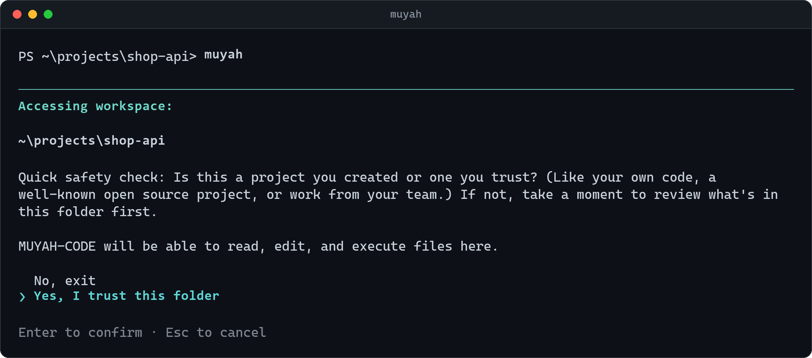
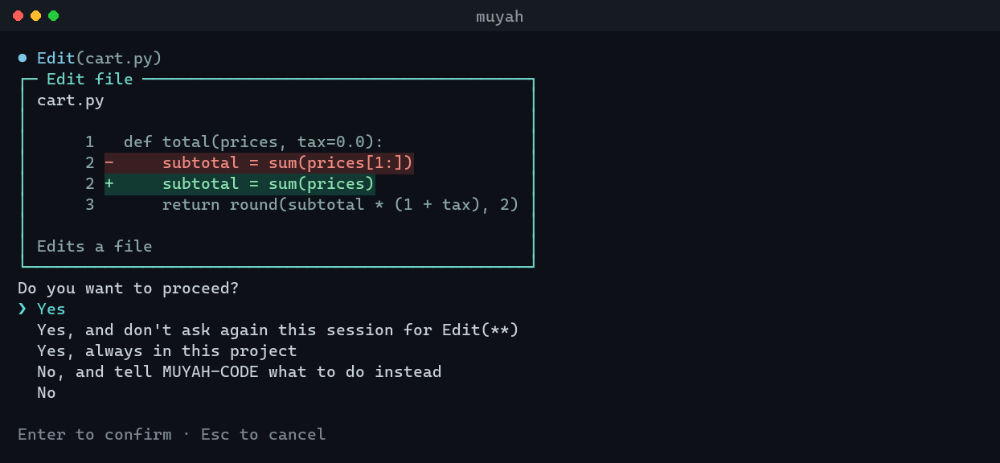
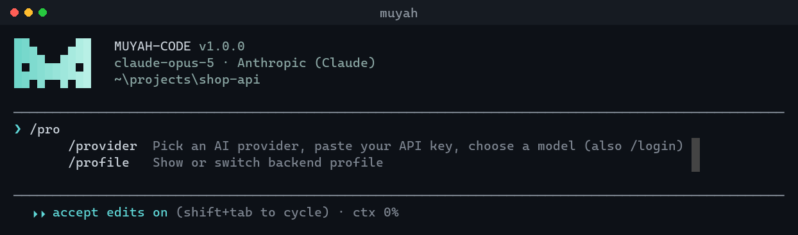
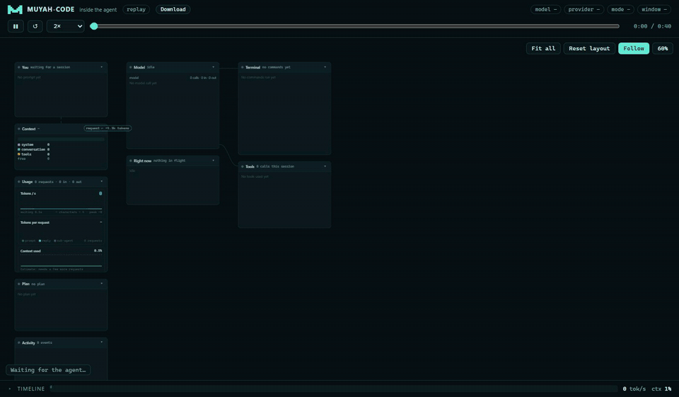

<p align="center">
  
</p>

<p align="center">
  <b>An agentic coding CLI for any model: Claude, OpenAI, Gemini, OpenRouter, local Ollama/vLLM, or your own GPU.</b><br>
  It reads, searches, edits and runs your code, asks before it acts, and learns from its own mistakes.
</p>

<p align="center">
  <a href="https://github.com/MUYAHGaious/muyah-code/actions/workflows/ci.yml"></a>
  
  
  
  <a href="LICENSE"></a>
</p>

<p align="center">
  
</p>

## Why MUYAH-CODE

- **Any model, one key away.** `muyah login` lists 20 providers. Pick one, paste your key, and you're coding. Claude runs through Anthropic's native API; everything else through an OpenAI-compatible one.
- **Built for open-weights models too.** Strict tool calling with a fallback text protocol, and context compaction that adapts to any window size (8k–1M) and to how each model counts tokens.
- **Asks before it acts.** You see the exact diff or command before approving it, and `/undo` reverts a whole turn.
- **Gets better over time.** It turns its own failures and fixes into lessons, and `muyah eval` measures whether that's helping.
- **Runs your own GPU.** `muyah serve` starts Ollama, vLLM, llama.cpp, colibri or Soup locally, and a Colab notebook serves big models through a tunnel.

<table>
  <tr>
    <td width="50%"><br><sub><b>Trust check</b>: asked once per folder, before any of the folder's own hooks or MCP servers load.</sub></td>
    <td width="50%"><br><sub><b>Permission prompts</b> show the exact change. Choose with ↑/↓ and Enter.</sub></td>
  </tr>
  <tr>
    <td colspan="2"><br><sub><b>Type <code>/</code></b> for the command menu. The status line shows the mode and how full the context is.</sub></td>
  </tr>
</table>

## Install

You need Python 3.10 or newer.

```bash
pipx install muyah-code          # recommended: isolated install, `muyah` lands on your PATH
# or: uv tool install muyah-code
# or: pip install muyah-code

muyah login                      # pick a provider, paste your API key
muyah                            # start coding
```

**Update:** `pipx upgrade muyah-code`. **Don't have pipx?** Run `python -m pip install --user pipx`, then `python -m pipx ensurepath`.

**From source (development):** `git clone https://github.com/MUYAHGaious/muyah-code && cd muyah-code && pip install -e ".[dev]"`.

> **Windows:** `python -m muyah_code` always works, even if `muyah` is not on your PATH yet.

## Connect a model

**The easy way: pick a provider and paste your key.**

```bash
muyah login            # or /provider inside a session
```

1. Choose a provider from the list. It includes Anthropic (Claude), OpenAI, Google Gemini, OpenRouter, Groq, DeepSeek, Mistral, xAI, Together, Fireworks, Cerebras, Moonshot (Kimi), Z.ai (GLM), Qwen, NVIDIA NIM, Hugging Face, plus local Ollama, LM Studio, llama.cpp and vLLM.
2. Paste your API key. The input is hidden.
3. Pick a model. The best coding models are listed first, and pressing Enter takes the default.

MUYAH-CODE then checks the key, tests one reply, saves everything and switches your session to it.

Useful details:
- **Keys you already have are detected.** If `OPENAI_API_KEY`, `ANTHROPIC_API_KEY`, `GEMINI_API_KEY` or similar is set, it offers to use it. Those keys are never copied to disk.
- **Where pasted keys go:** `~/.muyah/credentials.json`, never `settings.json`.
- **Switching providers:** `/profile anthropic` or `muyah --profile openai`.
- **Removing a key:** `/logout <provider>` or `muyah logout <provider>`.
- **Skipping the prompts:** `muyah login anthropic --key sk-ant-... -m claude-opus-5`.
- **Claude** is used through Anthropic's native API rather than a compatibility layer. That gives it adaptive thinking, prompt caching (cheaper repeat turns) and automatic refusal fallbacks. The default model is `claude-opus-5`.

Or, for your own GPU or a custom server, choose one of the following.

**A. Your Colab GPU (or RunPod / any Linux GPU box).**
1. Open `backend/muyah_server.ipynb` in Colab and pick a GPU runtime.
2. Choose the engine and model in the settings cell, then run all cells.
3. The notebook starts the server, opens a tunnel, runs a PONG test and prints a command like this, which you then run on your computer:

```bash
muyah connect https://xyz.a.pinggy.link/v1 --model Qwen/Qwen2.5-Coder-32B-Instruct-AWQ --engine vllm --context-window 32768
```

**B. A server on your machine.**

```bash
muyah connect --scan                      # finds Ollama (11434), LM Studio (1234), vLLM/colibri/Soup (8000), llama.cpp (8080)
muyah serve ollama  -m qwen2.5-coder:14b --ctx 32768          # or start one: it waits until ready, then connects
muyah serve colibri -m /nvme/glm52_i4 --ctx 65536
muyah serve soup    -m ./output                                # your fine-tuned model
muyah serve llamacpp -m ./qwen2.5-coder-7b-q4_k_m.gguf --ctx 32768
muyah serve --status | --stop
```

**C. A hosted API.**

```bash
muyah connect https://openrouter.ai/api/v1 --api-key sk-or-... --model qwen/qwen3-coder
```

Every `connect` or `serve` saves a **profile**. Switch between profiles with `muyah --profile colab` or `/profile ollama` inside a session. `muyah doctor --deep` checks the whole setup, including a real completion and a tool-calling test.

### Huge models on your own hardware: colibri and Soup

MUYAH-CODE is built to drive models you run yourself, including ones far bigger than your GPU.

- **[colibri](https://github.com/JustVugg/colibri)** runs very large mixture-of-experts models from NVMe
  and RAM instead of VRAM. Build a model with colibri's tools, then start it and connect in one command:
  ```bash
  muyah serve colibri --model /nvme/glm52_i4 --ctx 65536
  ```
  MUYAH-CODE applies a preset made for it:
  - no request timeout, because the first token can take minutes;
  - no extra reflection calls;
  - one request at a time.

  The live view shows the long waits for what they are: *sent · waiting for reply*.
- **Soup** serves models you fine-tuned with it:
  ```bash
  muyah serve soup --model ./output
  ```
- **Free GPU:** the [server notebook](backend/) runs vLLM, colibri or Soup on Colab. It prints the
  `muyah connect …` line to run on your computer.
- `muyah serve --status` shows the running server and `muyah serve --stop` stops it.

MUYAH-CODE starts and connects these engines, but it does not download or convert models: getting a model
ready is done with each engine's own tools. For one-command downloads, use `muyah serve ollama --model
qwen2.5-coder:14b`.

### Engine modes

Each engine gets a tuned preset. You select it with `--engine` or `muyah serve <engine>`.

| engine | preset | notes |
|---|---|---|
| `vllm` | timeout 600s | serve with `--enable-auto-tool-choice --tool-call-parser hermes` (Qwen) for native tools |
| `colibri` | **no timeout**, no reflection calls, 4k output | huge MoE on NVMe/RAM; first token can take minutes; one request at a time |
| `soup` | timeout 600s, 4k output | fine-tuned models via `soup serve`; runs in its own Python 3.10-3.12 env |
| `ollama` | started with `OLLAMA_CONTEXT_LENGTH` | Ollama silently truncates at its small default context otherwise |
| `llamacpp` | `--jinja` | native tool calling from the model's chat template |

> **Tunnels:** Cloudflare quick tunnels drop requests that stay silent for about 100s (HTTP 524). A big model working through a long prompt can hit that before its first token. MUYAH-CODE detects a 524 and tells you to switch to the **Pinggy** URL, which has no such limit. The server notebook prints both.

## Use it

```bash
muyah                                   # interactive
muyah "fix the failing test in tests/test_api.py"
muyah -p "summarize this repo" --output-format json      # headless (CI, scripts)
git diff | muyah -p "review this diff"                   # stdin is attached to the prompt
muyah -c                                # continue the last session
muyah --resume                          # pick an earlier conversation from a list (or: muyah --resume <id>)
```

**Interactive shortcuts:**
- `/` opens the command menu: move with **↑/↓**, choose with **Enter**. Every list works this way (providers, models, permission prompts).
- `@path` attaches a file.
- `#note` saves a note to `MUYAH.md`.
- **Shift+Tab** cycles permission modes.
- **Talk instead of typing:** Ctrl+Space (or `/mic`) opens Windows voice typing, which types into the prompt.
- **Big pastes** show as `[Pasted text #1 +245 lines]`; the full text is sent.
- **While it works, keep typing.** **Enter** queues a message; the model gets it at the next step. **Esc** stops the current step and sends it right away.
- **Alt+Enter** / **Ctrl+J** inserts a newline.
- **Ctrl+C** stops a running reply, or clears what you typed. Press it twice on an empty line (or **Ctrl+D**) to exit.

| command | what it does |
|---|---|
| `/help` | all commands |
| `/provider` (or `/login`), `/logout <provider>` | pick a provider + paste an API key; remove a saved key |
| `/model [id]`, `/models`, `/profile [name]`, `/connect <url>` | switch backends at runtime (the context window is re-detected) |
| `/mode [default\|acceptEdits\|plan\|bypassPermissions]`, `/plan` | permission modes |
| `/undo`, `/rewind` (Esc Esc) | go back to before the last turn, or any earlier one: code, conversation or both (commands' changes included) |
| `/verify [quick\|full\|e2e]` | check the last changes only when you ask: lint + the changed files' tests, the whole suite, or run the app end to end |
| `/mic` (Ctrl+Space) | talk instead of typing (Windows voice typing) |
| `/compact [focus]`, `/context` | context management |
| `/skills`, `/<skill> [args]`, `/agents` | workflows and sub-agents |
| `/lessons`, `/good [note]`, `/bad [what was wrong]`, `/learn on\|off` | the learning system |
| `/init`, `/memory` | project instructions (`MUYAH.md`) |
| `/resume`, `/sessions`, `/export` | sessions |
| `/viz`, `/viz stop` | live view of the agent in your browser (or run `muyah viz` in another terminal) |
| `/theme [teal\|muyah\|ocean\|forest\|mono\|light]` | color theme (saved; default: light teal) |
| `/usage [--all]` (or `muyah usage`) | cost, tokens, cache hits, where the tokens went, the context, today and 7 days, your provider's limits |
| `/status`, `/doctor`, `/config`, `/permissions`, `/tools`, `/mcp` | inspection |

### Permission modes

**Shift+Tab** cycles **plan → edit → manual → auto**. Each mode has its own color in the status line.

| Mode | What it does |
|---|---|
| **plan** (green) | Read-only: the agent explores and proposes a plan. |
| **edit** (violet) | Accepts file edits inside the project; asks before commands. |
| **manual** (default) | Asks before edits, commands and network access. Read-only commands such as `git status` or `ls` never ask. |
| **auto** (yellow) | Runs on its own. Still asks for risky actions: bulk or forced deletes, `git push`, `git reset --hard`, publishing, `sudo`, piping downloads into a shell, and edits outside the project. |
| bypassPermissions | No checks at all. Only with `--mode bypassPermissions`, for throwaway environments. |

When asked, you can answer **y**, **a** (always allow this session), **p** (always allow in this project, saved to `.muyah/settings.local.json`), **n**, or type what to do instead.

Rules use the Claude Code syntax:

```json
{"permissions": {"allow": ["Bash(npm run test:*)", "Edit(src/**)", "WebFetch(domain:docs.python.org)"],
                 "deny":  ["Bash(rm -rf *)", "Write(**/.env)"]}}
```

## How it thinks

These habits are written into the system prompt:
- It explores before it edits, and it must **Read a file before editing it**.
- It plans anything with 3 or more steps in a **todo list**.
- It **verifies with real commands** before claiming success, and it reports failures honestly.

**Skills** are workflows it loads on demand. The bundled ones are `debugging`, `planning`, `verification`, `tdd`, `code-review`, `brainstorming` and `commit`. You can add your own:
- Put them in `.muyah/skills/<name>/SKILL.md` or `~/.muyah/skills/`.
- Claude Code `.claude/skills` also load.

**Sub-agents** (`explore`, `general`, or your own in `.muyah/agents/*.md`) work in a fresh context and hand back only a report. That keeps a small context window clean.

## Watch it think

Open the live view in your browser and keep it next to your terminal. It is a board of panels you can pan
and zoom, like a design canvas. Every panel shows the real content, as it happens:
- **You**: your prompt, and messages you typed while it works (queued, then delivered).
- **Model**: its true state (preparing, *sent · waiting for reply*, streaming, idle, failed), with the
  thinking and the answer as they stream.
- **Terminal**: every command, its output and exit code.
- **A panel per file**: the content being written, the diff of an edit, the lines that were read.
- **A panel per sub-agent**, created when it spawns, with its own steps.
- **Skills** (the skill in use and its instructions), **MCP** servers and their calls, **Hooks**, the
  **Plan**, **Lessons** and the **Context** window.

Click any panel or item for the full detail: a whole file history, full command output, a lesson and where
it is stored. States are real events, never animation guesses: a tool waiting for your approval shows as
waiting, not running. **Fit all** shows the whole board and **Follow** keeps the active panel in view.

The **Activity** panel is the full log of every state change. Filter it (model calls, tools, commands,
sub-agents, hooks, errors) and open any line to see the raw event. Every session's log is also saved
next to its transcript, so `muyah viz --replay` can play any past session again.

<p align="center">
  
</p>

There are two ways to open it:

```bash
muyah viz                 # in a second terminal, in the same folder: follows your session live,
                          #   and switches to the next one when you start another
/viz                      # or type this inside a session (MUYAH-CODE also offers it at startup)
muyah viz --replay [id]   # replay the last (or any) recorded session: --speed 0.1 to 16, seek, pause
```

The page is served on `127.0.0.1` only, behind a random token. It is self-contained, so nothing is loaded from the internet.

## It learns

1. **Signals.** During each turn MUYAH-CODE records what happened: tool errors, *errors that were later fixed*, loops and step limits. It also records your feedback: `/good`, `/bad`, and corrections such as "no, that's wrong…".
2. **Reflection.** When a turn produced meaningful signals, one small model call extracts 0–3 generalizable **lessons**. They're stored in `~/.muyah/lessons.jsonl` (global) and `.muyah/lessons.jsonl` (this project), and near-duplicates are merged.
3. **Recall.** For each new request, the most relevant lessons (BM25 × usefulness score) are attached to your message.
4. **Scoring.** Lessons used in turns you accept gain score. Lessons used in turns you correct lose score, and consistently harmful ones are pruned. `/lessons` shows them and lets you delete any.

**Measure it.** `muyah eval` runs the bundled benchmark tasks (fix a bug, add a CLI flag, implement a function, a multi-file rename, a traceback fix) headless against your current model and records the pass rate in `~/.muyah/evals.jsonl`. `muyah eval --no-learn` gives a baseline without lessons.

## Configuration

Settings are layered. Each layer overrides the one before it:
1. defaults
2. `~/.muyah/settings.json`
3. `.muyah/settings.json`
4. `.muyah/settings.local.json`
5. `--settings`
6. the active profile
7. `MUYAH_*` environment variables
8. CLI flags

Your old colab-code config is imported automatically on first run.

```json
{
  "base_url": "http://localhost:8000/v1", "model": "…", "api_key": "none",
  "context_window": 0,          // 0 = ask the server, then the model table, then 16384
  "max_tokens": 4096, "temperature": 0.2, "request_timeout": 300,   // 0 = never time out
  "tool_mode": "auto",          // auto | native | text
  "compact_threshold": 0.8, "max_steps": 60, "bash_timeout": 120, "shell": "auto",
  "theme": "teal",
  "learning": {"enabled": true, "reflect": true, "max_lessons_in_prompt": 5},
  "permissions": {"mode": "default", "allow": [], "ask": [], "deny": []},
  "hooks": {"PreToolUse": [{"matcher": "Bash", "hooks": [{"type": "command", "command": "python guard.py"}]}]},
  "profiles": {"colab": {"base_url": "https://…/v1", "model": "…", "engine": "vllm"}}
}
```

**Context handling for any model size:**
- **Window size:** taken from your setting, else the server's `/v1/models`, else a table of known models.
- **Estimate calibration:** the token estimate is corrected using the real `prompt_tokens` the server reports.
- **When to compact:** at 80% of the window. Old tool outputs are pruned first, then older turns are summarized.
- **Overflow errors:** if the server still reports a context overflow, an emergency compaction runs and the request is retried.
- **Scaled budgets:** output and tool-output limits scale with the window.
- **Prompt caching:** the system prompt stays byte-for-byte stable between turns, and per-turn material goes after it.
  - Local servers (vLLM, colibri, llama.cpp) reuse their prefix cache instead of re-reading everything.
  - On Anthropic the stable part is marked for caching. Cached input is billed at about a tenth of the normal price, so long sessions cost much less.

**Cost and budgets.** Every model call is counted: the agent's, sub-agents', compaction, learning and web page
summaries. Each one is priced, and cached input is priced separately.
- **Prices** come from your own `pricing.models` first, then OpenRouter's live list, then LiteLLM's public
  price table. A copy of that table ships with MUYAH-CODE and is refreshed once a day.
- **Self-hosted is free:** a model on your machine, your network or your own tunnel (Colab) costs $0.
- **Never guessed:** a model found in no price list shows as "unpriced".
- **Where it shows:** the status line shows what the session has cost so far, and the line after each turn shows that turn's cost.
- **Budgets:** `{"budget": {"session_usd": 5, "daily_usd": 20}}`.
  - At 80% of a limit you get a warning.
  - At 100% the agent asks before sending the next request. With `-p`, it stops instead; `--max-cost 2` sets a session limit there.

```json
{"pricing": {"models": {"my-finetune": {"input": 0.5, "output": 1.5, "cache_read": 0.05}}}}   // $ per 1M tokens
```

**Hooks** follow Claude Code's format: `PreToolUse`, `PostToolUse`, `UserPromptSubmit`, `Stop` and more.
- The hook gets JSON on stdin.
- Exit code `2` blocks the action.
- To modify the action, print JSON such as `{"hookSpecificOutput": {"permissionDecision": "deny"}}`.

**MCP servers** are configured in `.mcp.json` or `~/.muyah/mcp.json` (stdio or HTTP). Their tools appear as `mcp__<server>__<tool>`.

## Development

```bash
pip install -e ".[dev]"
python -m pytest -q          # 188 tests: parser, tools, permissions, context, learning, hooks, full agent loop
python -m ruff check .       #   against a scripted fake OpenAI server, headless CLI, REPL, eval harness
```

**Layout:**
- `muyah_code/llm`: client and text tool-call parser.
- `tools/`: the built-in tools.
- `agent/`: the loop, context management and prompts.
- `permissions.py`, `hooks.py`, `session.py`, `subagents.py`
- `learning/`: lessons and eval.
- `ui/`: terminal, REPL and commands.
- `events.py` + `viz/`: the event stream and the live/replay web view (`scripts/make_viz_demo.py` records the demo).
- `mcp/`
- `backends.py` / `serve.py`: model servers.
- `backend/`: the server notebook.
- `evals/`: benchmark tasks.

## Roadmap

- **Self-training loop:** MUYAH-CODE's session transcripts and lessons are a record of its own successful work. Once there's enough of it, [Soup](https://github.com/MakazhanAlpamys/Soup) can fine-tune a LoRA on that data, and `muyah serve soup` can serve the result.
- More eval tasks, per language.
