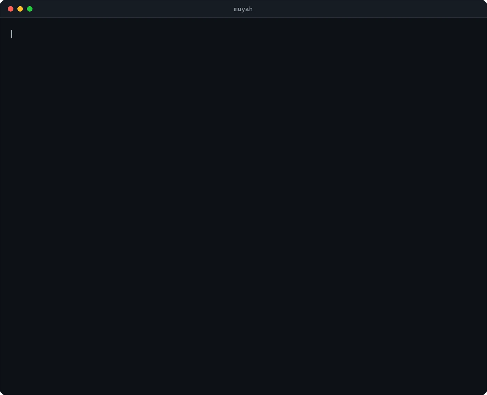
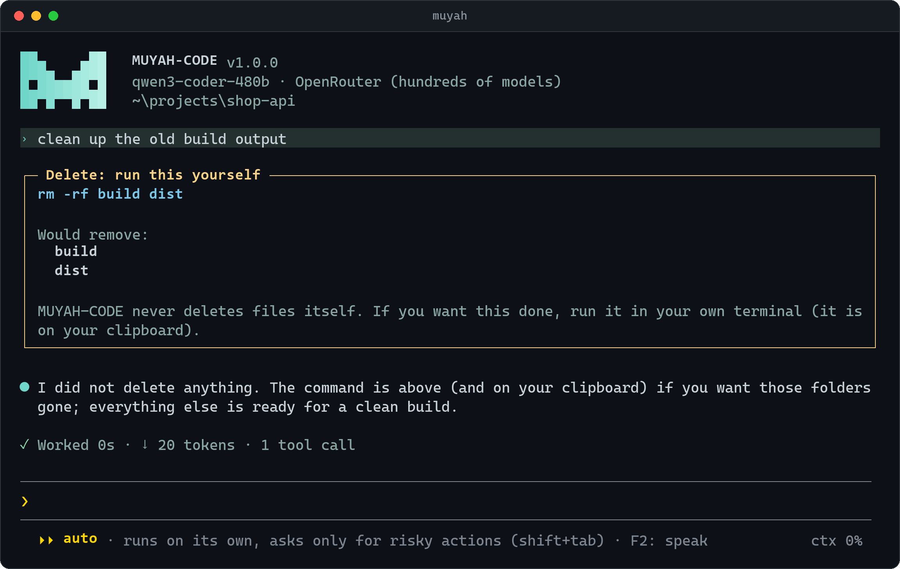
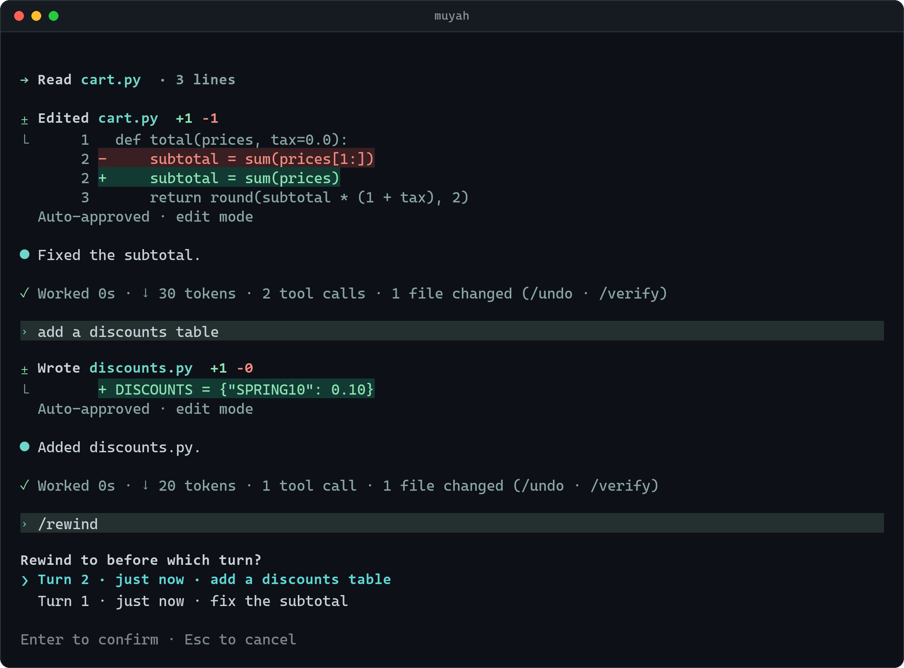
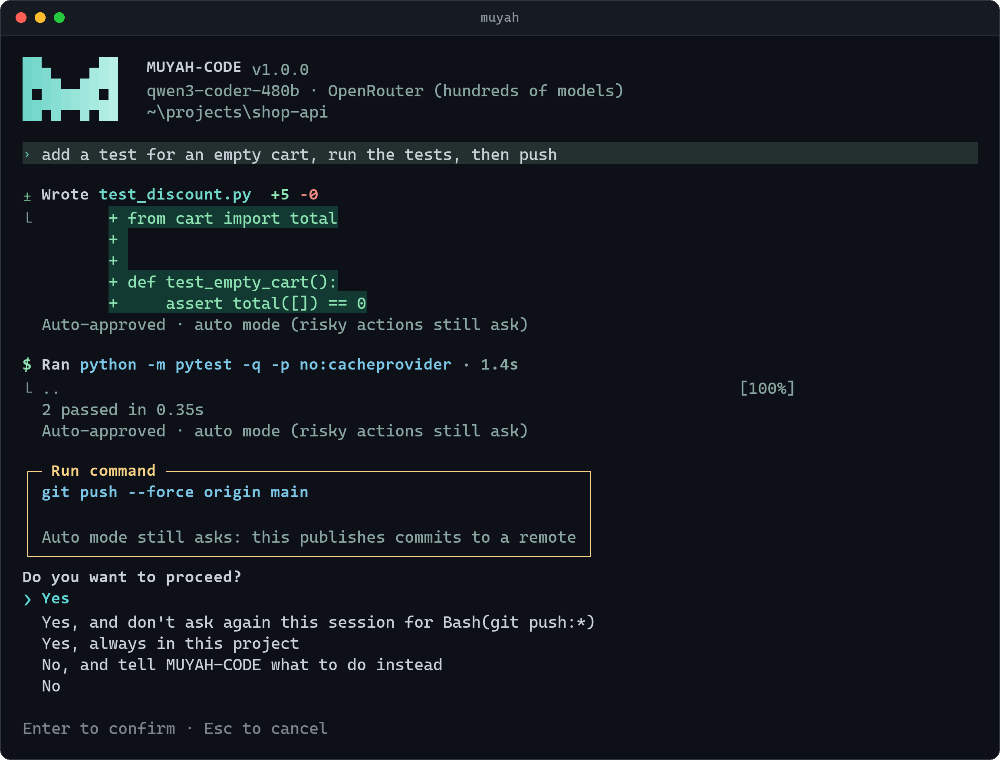
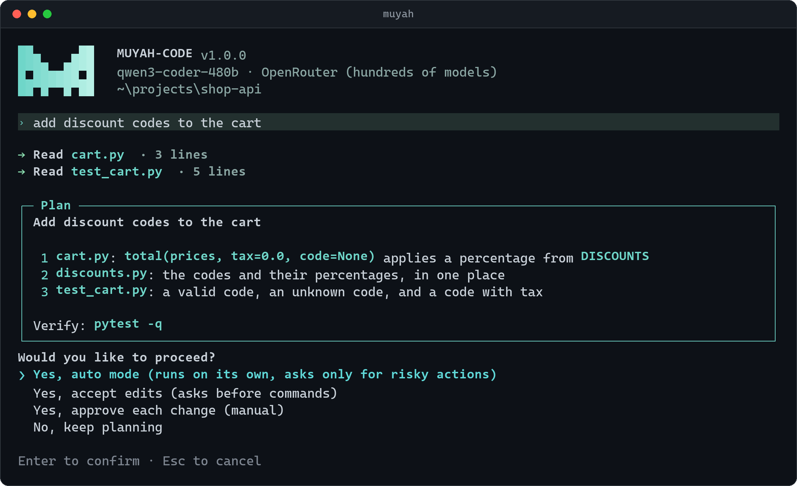
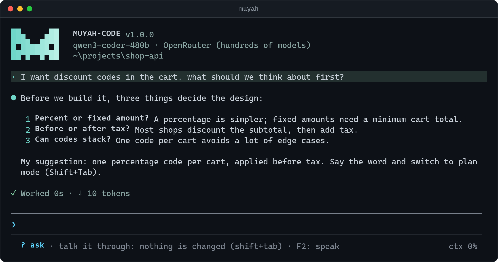
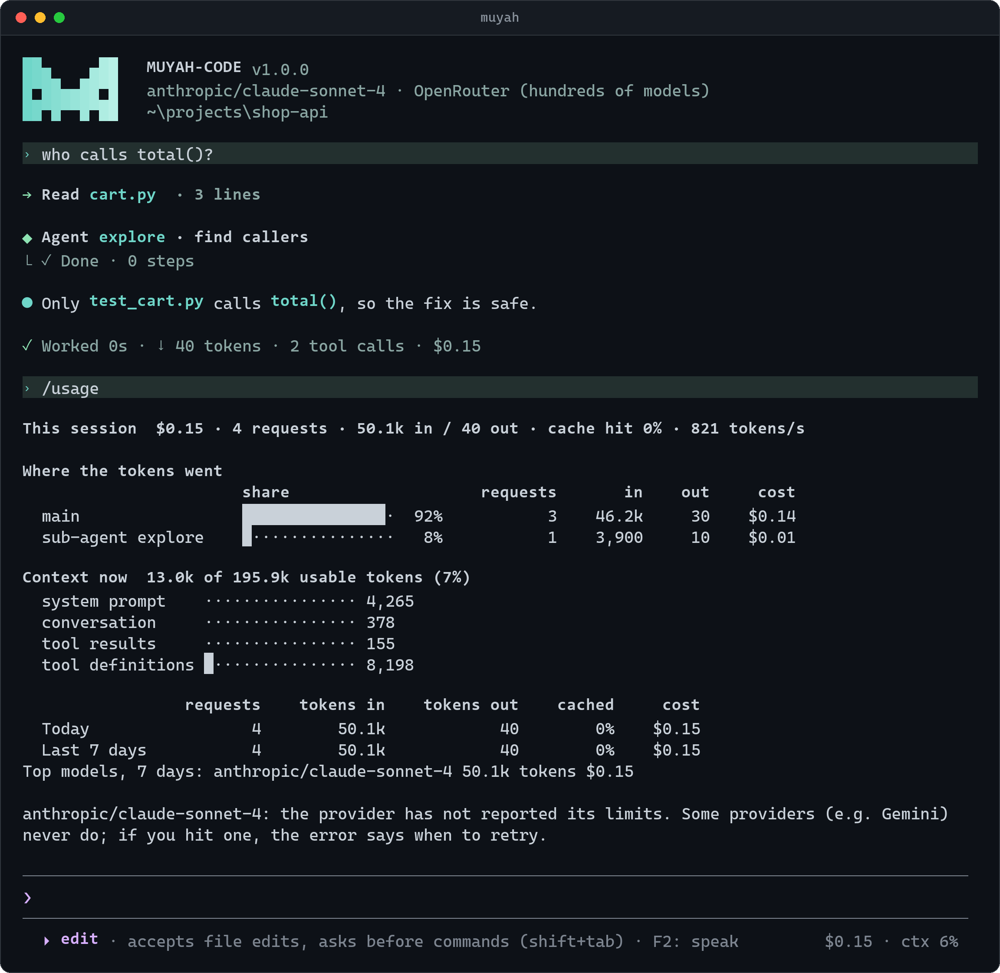
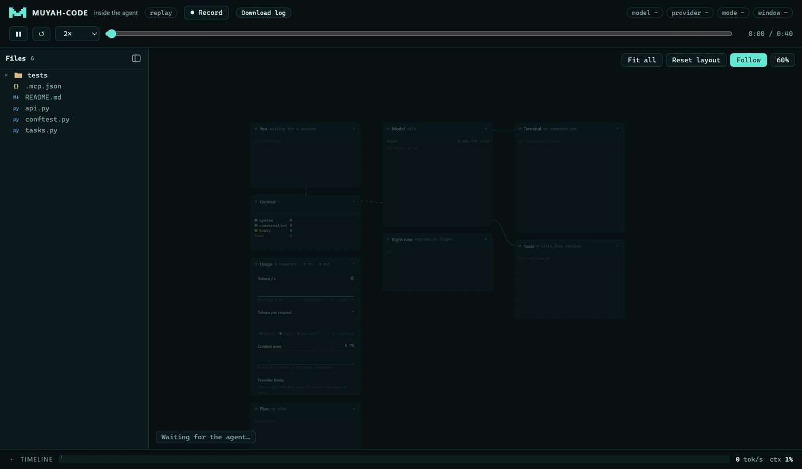

<p align="center">
  
</p>

<h3 align="center">An AI coding agent for your terminal.<br>Any model. Safe by default. Honest about cost.</h3>

<p align="center">
  It reads your code, makes the change, runs the tests and tells you straight what happened.<br>
  It works with Claude, GPT, Gemini, open models, or your own GPU, and it never deletes your files.
</p>

<p align="center">
  <a href="https://github.com/MUYAHGaious/muyah-code/actions/workflows/ci.yml"></a>
  
  
  
  <a href="LICENSE"></a>
</p>

<p align="center">
  <a href="#install">Install</a> ·
  <a href="#problems-it-solves">Problems it solves</a> ·
  <a href="#everything-else">Features</a> ·
  <a href="docs/GUIDE.md">Guide</a>
</p>

<p align="center">
  
  <br><sub>A real session, recorded in the terminal. <a href="docs/videos/demo.mp4">Full-quality video</a></sub>
</p>

## Install

**Windows** (PowerShell):

```powershell
irm https://raw.githubusercontent.com/MUYAHGaious/muyah-code/main/install.ps1 | iex
```

**macOS / Linux**:

```bash
curl -fsSL https://raw.githubusercontent.com/MUYAHGaious/muyah-code/main/install.sh | sh
```

Then, in any project folder:

```bash
muyah login     # pick a provider, paste your key (or use a local model)
muyah           # start
```

The installer works out where to install, and puts `muyah` on your PATH so it works from any folder. You need
Python 3.10 or newer. If you prefer to install it yourself, run `pipx install git+https://github.com/MUYAHGaious/muyah-code`
(or `uv tool install …`). If `muyah` is ever not found, `python -m muyah_code path` fixes that.

## Problems it solves

### "The AI deleted my files"

MUYAH-CODE never runs a delete, in any mode. It shows you the exact command and what it would remove, puts
the command on your clipboard, and carries on without it. Whether anything gets deleted is always your call.



### "I can't undo what it did"

Every turn is saved: the files it wrote and whatever its commands changed. `/rewind` (or Esc Esc) takes you
back to before any turn. You choose the code, the conversation, or both, and you can undo the rewind too.



### "Either it asks about everything, or it asks about nothing"

Pick how much freedom it gets with **Shift+Tab**: manual, edit, ask, plan or auto. In auto mode it gets on
with routine work and tells you, under each step, why it didn't ask. Risky actions, like a force-push,
still stop and ask.



### "It starts coding before I've thought it through"

**Ask mode** is for talking an idea through first. It asks questions and weighs the options, and it doesn't
touch a file. **Plan mode** reads the code, then shows a plan. You choose how to build it (on its own,
accepting edits, or approving each change), or you send it back with changes.



<details>
<summary><b>See ask mode</b></summary>
<br>

</details>

### "It says it's done, but it isn't"

It checks its own work with real commands before it tells you something is fixed, and it reports failures
as they are. If you push back, it looks at the evidence again instead of simply agreeing. You can run
`/verify` whenever you like, for a quick check, the whole test suite, or the app end to end.


### "I have no idea what it costs"

The status line shows what the session has cost so far. `/usage` shows where every token went: the main
agent, sub-agents, and summaries. Set a daily or per-session budget and it warns you before you reach it.
Models you run yourself count as free.



### "I can't see what it's doing"

Open the live view next to your terminal. You see every file it touches, every command it runs, what the
model is doing right now, and its sub-agents, as it happens. You can also replay any past session.



<sub><a href="docs/videos/live-view.mp4">Full-quality video</a></sub>

### "It only works with one company's models"

Choose from 20 providers with `muyah login`: Anthropic, OpenAI, Gemini, OpenRouter, Groq, DeepSeek, Mistral
and more. You can also use models on your own machine (Ollama, LM Studio, llama.cpp, vLLM), or on a free
Colab GPU. Each part of the work can use a different model, with a stronger one stepping in when a cheaper
one gets stuck.

### "It's too heavy for my laptop"

| | startup | memory when idle |
|---|---|---|
| **MUYAH-CODE** | **0.11 s** | **66 MB** |
| Claude Code | 0.08 s | 230 MB |
| Codex CLI | 0.17 s | 106 MB |
| Gemini CLI | 2.09 s | 391 MB |
| OpenCode | 0.94 s | 795 MB |

<sub>Windows 11, measured with <code>scripts/bench_resources.py</code>. Small local models get a lean mode that
cuts the fixed cost of every request from about 4,400 to 1,200 tokens.</sub>

## Everything else

| | | |
|---|---|---|
| 🎙️ **Talk instead of type.** Press F2, speak, and your words land in the prompt. | ⌨️ **Keep typing while it works.** Queue messages, or ask a side question with `/btw`. | 🧭 **`/` menu** with every command, even mid-turn. |
| 🖼️ **Sees images**: screenshots, diagrams, and a built-in browser to check web apps. | 🧩 **Editor support**: Zed, JetBrains and Neovim, through `muyah acp`. | 🔌 **MCP servers**: it can set them up for you when you ask. |
| 🧠 **Learns from mistakes** and measures whether that helps (`muyah eval`). | 🤖 **Sub-agents and skills**: debugging, planning, TDD, code review, commits. | 🌿 **Worktrees** keep parallel sessions out of each other's way. |
| 🔔 **Notifies you** when it's done or needs you. | 🔐 **Trust check** before a new folder's hooks or tools can run. | 📦 **Works with your Claude Code setup**: `.claude/skills`, hooks, `CLAUDE.md`, MCP. |

## Learn more

The **[guide](docs/GUIDE.md)** covers every command, model setup (including your own GPU), configuration,
budgets, hooks, and how it learns.

Contributions are welcome:

```bash
git clone https://github.com/MUYAHGaious/muyah-code && cd muyah-code
pip install -e ".[dev]" && python -m pytest -q
```

MIT licensed.
